> 博客有一些视频资源未展示，可到移步[知乎文章](https://zhuanlan.zhihu.com/p/585004939)，查看完整内容

## 背景

目前市场上有很多软件，通过使用图形连线加上一些编辑的功能去实现一些业务需求，比如说蓝图软件、流程图的软件、PPT 软件和电子电路设计图软件等等。从五月份到现在，我们在公司开发了一个车联网安全应用，并对它进行了一些思考设计和落地实施。

开发大型图编辑应用软件，我们需要明确哪些问题需要解决，这些问题可以从我们目前的产品效果入手。由于网联汽车安全的项目比较复杂，涉及到非常多的行业概念，比较晦涩难懂，为了让大家能够更加清晰地了解我们项目的大致内容，我设计了另外一个项目（如下方所描述），从而有利于理解：

> 博客有一些视频资源未展示，可到移步[知乎文章](https://zhuanlan.zhihu.com/p/585004939)，查看完整内容

我们要组建一个前端培训学校来招收学生，第一个学员明非，就职于犬安科技，是一名拥有 15 年编程经验的前端工程师。我们给他添加了“架构师”，“本科“标签；第二个学员张三，大三在读，前端初学者，本科学历。此时可以直接使用之前的“本科”标签，从左边拖入标签，也可以在右侧添加新的标签“小白”，来描述张三的技术水平，最后我们总计招收到两个学员。项目的第一步流程结束。

我们需要解决以下问题：

- 创建图形 / 编辑画布内容（实现图编辑）
- 画布/右侧表单/底部列表数据实时同步 （数据同步）
- 不同对象右侧表单的生成 （表单生成）

> 博客有一些视频资源未展示，可到移步[知乎文章](https://zhuanlan.zhihu.com/p/585004939)，查看完整内容

明非的需求: 学习node JS并达到精通水平；张三的需求：学习前端三门语言并达到熟悉水平；我们为每位学员选择相应的关联技术和关联目标，后台统计技术和目标数据并在右侧展示。项目的第二步流程结束。

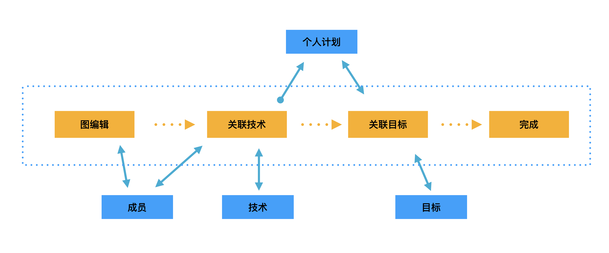

我们发现，各个数据是分布在各个步骤中使用的。例如：成员数据可以在图编辑和关联技术中使用，成员数据和技术数据组成个人计划数据，并在关联目标中使用，关联目标关联着目标数据。

我们需要解决以下问题：

- 多个步骤同一份数据的数据存储（数据存储）
- 多数据之间如何进行关联（数据关联）

我们要解决的问题可以分为三类：

- 图编辑实现

  - ReactFlow/X6的选择
  - 如何解决复杂图编辑需求
  - 遇到问题怎么办？
  - 如何与业务进行结合

- 流畅的全局数据和事件系统

  - 统一的数据列表
  - 统一的事件通讯

- 表单生成和数据变化监听

  - 表单生成方案
  - 绘图数据的无缝对接
  - 步骤数据的实时修改

## 图编辑实现

- 创建图形/编辑画布内容（实现图编辑）

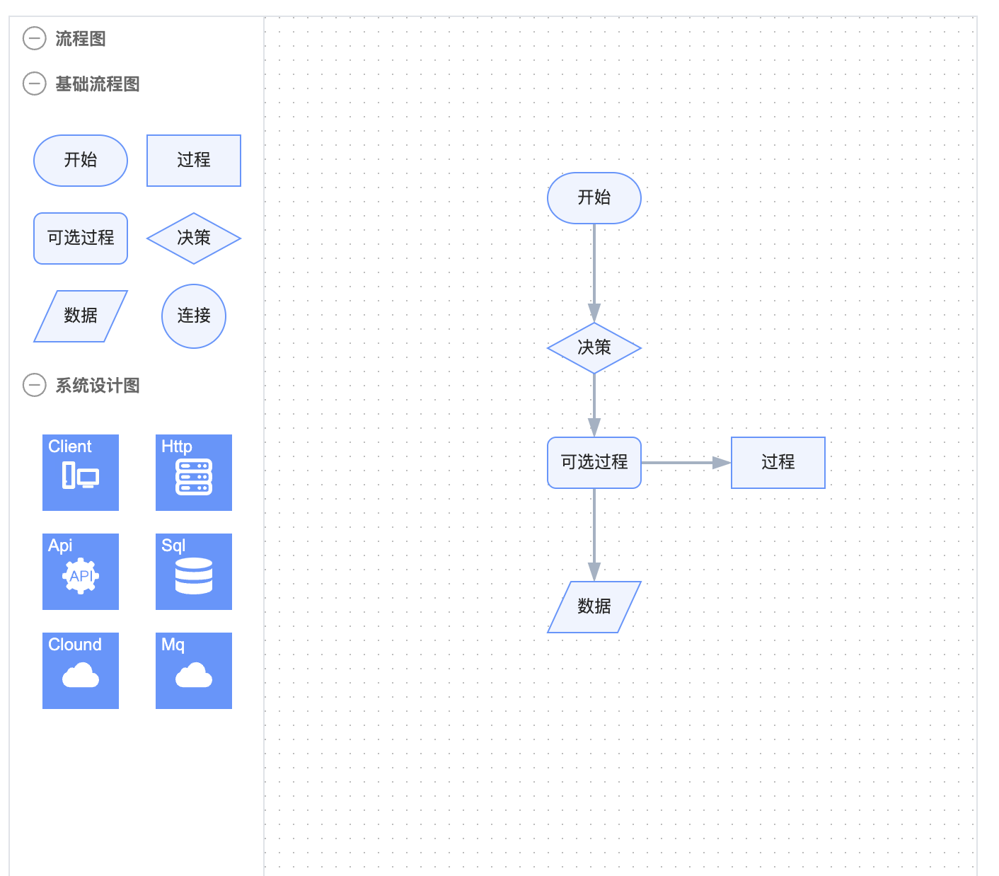

我们在日常开发中遇到的需求可能是做一个流程图属性图，使用的一些图编辑框架的基本的编辑能力即可实现。但更多情况，我们会结合我们的业务需求实现各种能力。

### 如何解决复杂图编辑需求?

例如：

> 博客有一些视频资源未展示，可到移步[知乎文章](https://zhuanlan.zhihu.com/p/585004939)，查看完整内容

实现连接桩的移动，并且避免移动中两个连接桩重合；移动到四个边角，圆角位置会发生变化。

> 博客有一些视频资源未展示，可到移步[知乎文章](https://zhuanlan.zhihu.com/p/585004939)，查看完整内容

实现连接桩的业务逻辑：不同属性的连接桩有不同的颜色，颜色不同，无法连接；连接状态的连接桩，其他属性的连接桩会变暗，从而表示不能连接。

### 如何选择框架?

我们需要找到一个十分靠谱的框架来实现上述复杂需求，ReactFlow和X6是市场上比较火的两个框架。我们根据自身所需要的功能，又根据两个软件的官网介绍可以提供的解决方案，如下图所示：

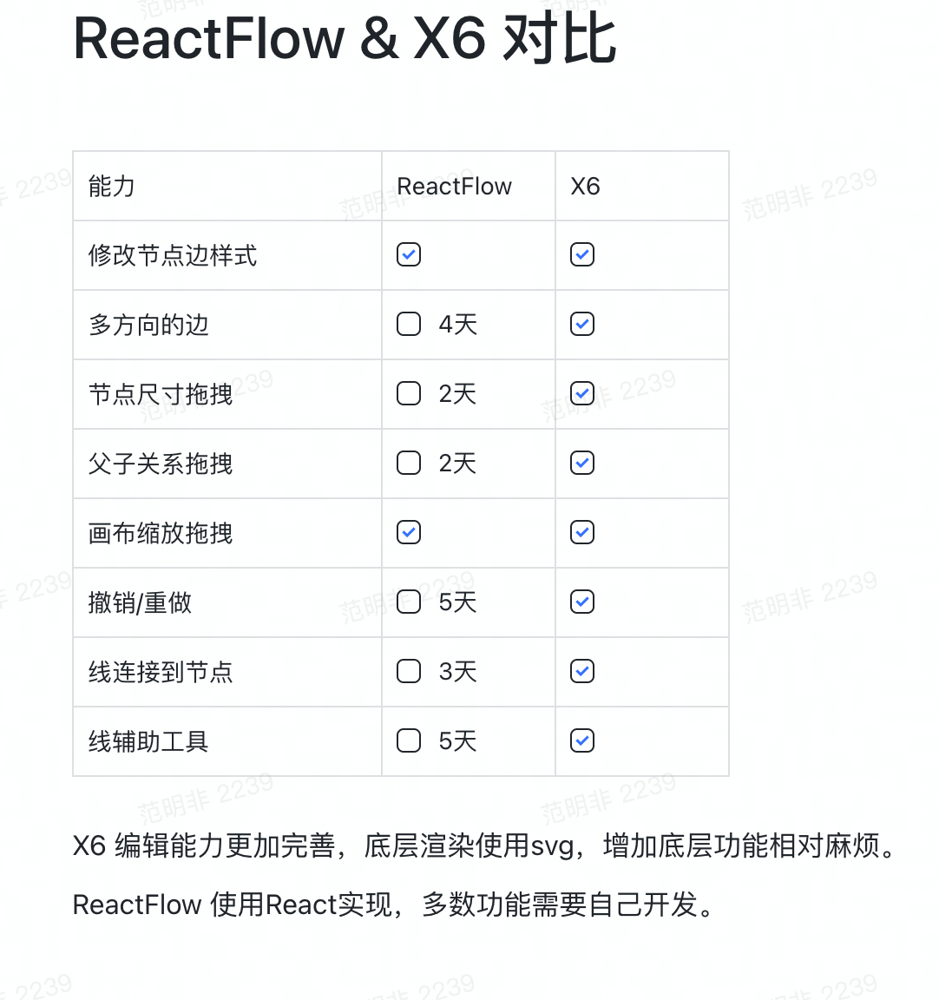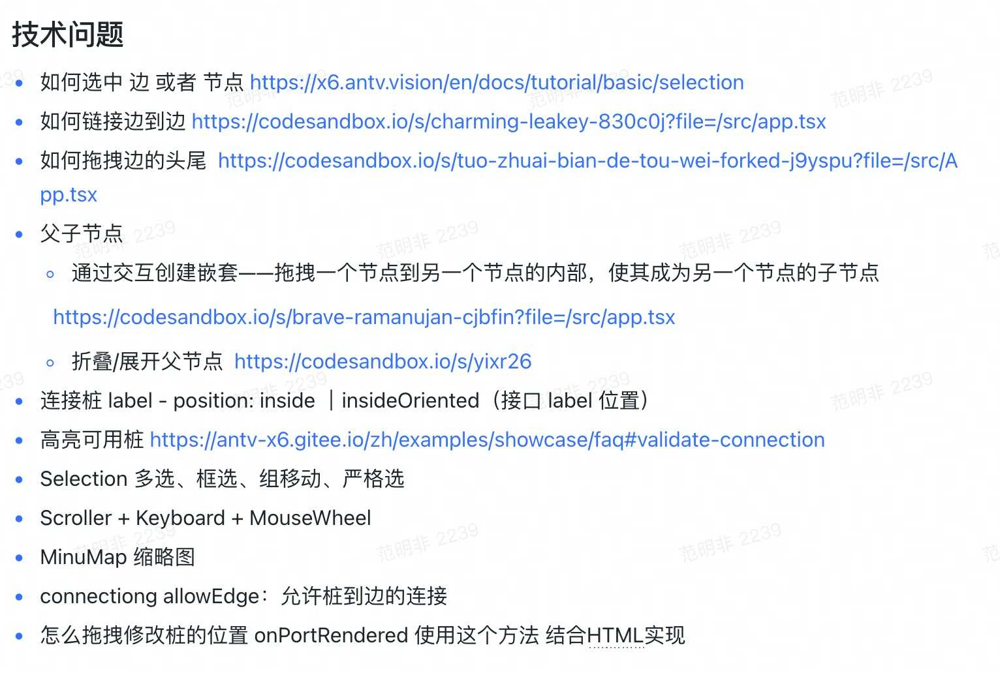

通过调研，我们得出以下结论：

1. react flow 实现了更符合前端的一些开发逻辑，但多数功能没有，需要自己开发；
2. X6 编辑能力比较完善，虽然增加底层功能会相对麻烦，但X6 现有的底层功能几乎满足我们所有定制化需求。

我们最终选择X6，事实证明我们的选择是正确的。

例如，解决我们项目中的一个复杂场景：

> 博客有一些视频资源未展示，可到移步[知乎文章](https://zhuanlan.zhihu.com/p/585004939)，查看完整内容

从一个内部连接桩连接到外部的连接桩：在每个跨越的元素上创建一个连接桩，然后把连接桩相互连接，在最后的连接线上创建一个圆点，然后把连接线拆成两根连到圆点上。

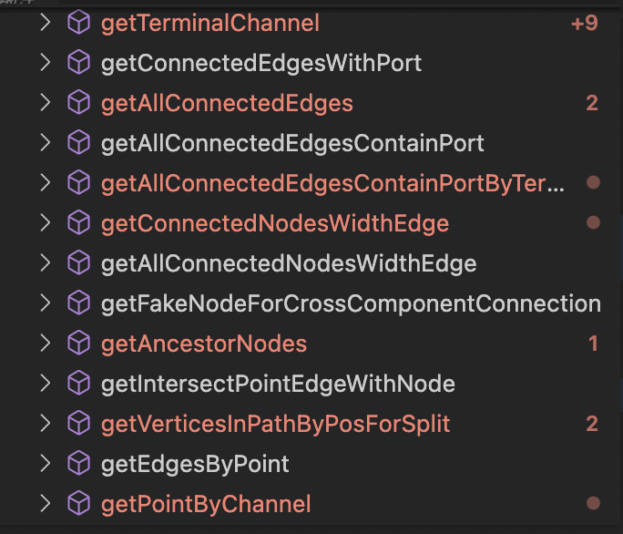

我们基于X6提供的一些API， 抽离了一些常用方法，并结合我们自己的业务逻辑去应对。

### 遇到问题怎么办？

使用开源库会发生很多问题：有些是我们的使用姿势问题，有些是开源库的一些bug；在使用一些普通功能，例如流程图，由于 X6经过很多项目的考验，基本没有什么问题；但我们的项目深度使用X6的各种功能，因此会出现一些问题；

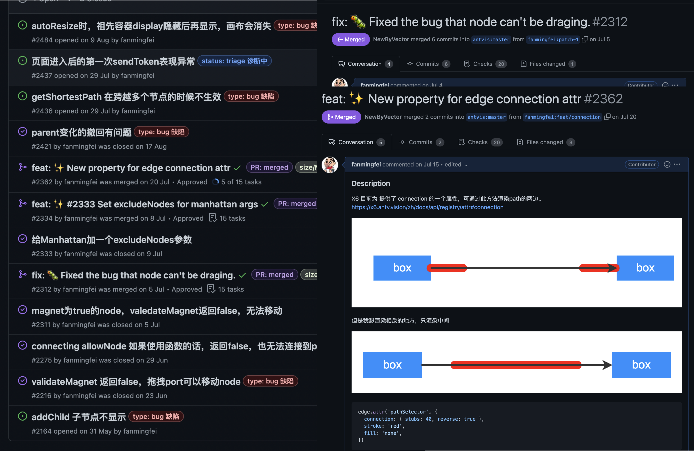

图左边是我在仓库提的问题，X6的官方人员响应十分及时。但有些问题是我们独有的，需要自己动手解决。右边其实是我提PR 解决问题的一个截图，我向 X6 提了三次PR ，每次都在两天之内就合并。它会自动去发布一个新版本，并可以直接在项目里投入使用。

### 如何与业务进行结合

业务逻辑不仅仅是编辑图像，我们还需要将图像结合到业务中去。下面我将用车联网安全产品来展示这一个demo的数据关系图。

> 博客有一些视频资源未展示，可到移步[知乎文章](https://zhuanlan.zhihu.com/p/585004939)，查看完整内容

元素可以包含子元素，元素上面会有连接桩，可以移动；连接桩中间有连接线；连接线中会有数据的流动。

由此可见，我们不仅需要X6帮助我们实现图的编辑和展示，还需要底层的数据引擎来实现绑定关系。

实现了一个数据引擎：

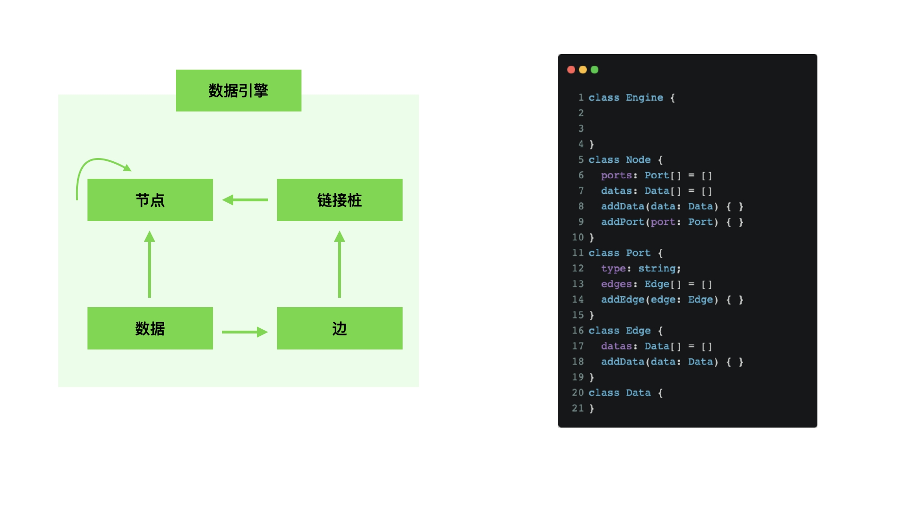

只看代码就是节点、连接桩、边、数据，比较简单；

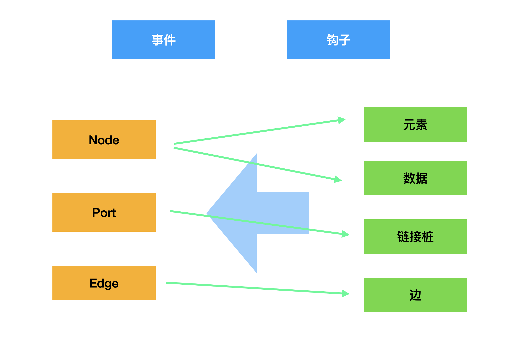

用面向对象的方式去做一些数据连接关系来绑定关系，只需要利用X6的事件和钩子，然后来调用。

例如：

添加一个node、连接桩和编的时候，监听X6的事件，来创建我们自己数据引擎的元素数据、连接桩和边。然后通过X6的一些功能，例如在一个元素里面添加一个子元素，我们的数据也会进行同步更新。

也可以调用我们数据引擎的一些方法，反过来操作X6上面图的一些变化。通过这种方式，我们可以解决非常多的图和数据绑定的问题，可以用在数据流程图、电子软件自动化、电子设计自动化软件、游戏引擎低代码工具等等工程中。

## 数据存储和数据关联

- 多个步骤使用同一份数据的数据存储（数据存储）
- 多数据之间如何进行关联（数据关联）

由于前端图编辑的逻辑比较复杂，我们强依赖前端的各种操作交互，因此图编辑步骤完全由前端自行管理；关联技术和关联目标是由前端调用服务端（后端）去完成的。

下面是一个图编辑画布中数据变化修改的数据流程图

> 博客有一些视频资源未展示，可到移步[知乎文章](https://zhuanlan.zhihu.com/p/585004939)，查看完整内容

当图编辑的节点数据发生变化，一方面要保存到前端的数据存储里面，另外一方面要把它保存到服务端，具体流程是通过一个事件系统告诉事件系统的一个模型，去保存图编辑的一个信息，事件系统会调用请求模块，通过数据服务把图编辑的节点信息存储到服务端。

> 博客有一些视频资源未展示，可到移步[知乎文章](https://zhuanlan.zhihu.com/p/585004939)，查看完整内容

当我们进入一个关联目标的步骤的时候，这个步骤就是一个React 文件。进入文件以后，我们需要个人计划数据和目标数据，走到事件系统，告诉个人计划，取个人计划数据，告诉个人目标，取个人目标数据，然后通过请求回到服务端。返回服务端以后，需要进行一个数据处理（后面会讲到数据处理的原因）。数据处理结束以后，生成一个前端可用的数据，并存放在数据存储器里面。数据存储器发生变化，里面的React 文件会响应它的变化。

我们需要下面的三个要点：

1. 将业务进行拆分，区分出多个模型；
2. 每个模型只负责自己的事情，但是它可以相互调用；
3. 通过命名空间区分模型，并且提供类型提示。

模型的区分最好是由前端后端共同理解业务需求，一起探讨总结得出，这样才能更好的理解业务，有助于我们的系统设计概念清晰、结构合理，从而更加可理解、可维护。

例如：

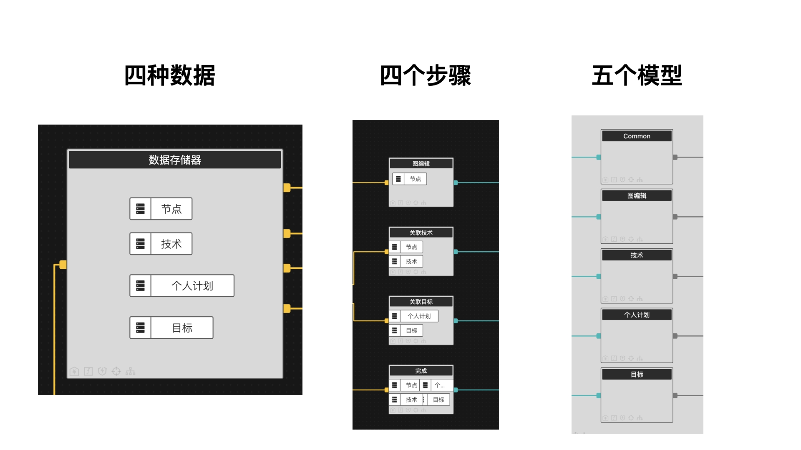

将培训学校的这个项目分成了四种数据、四个步骤 、五个模型，分布在各个步骤和各个数据当中。

数据设计：

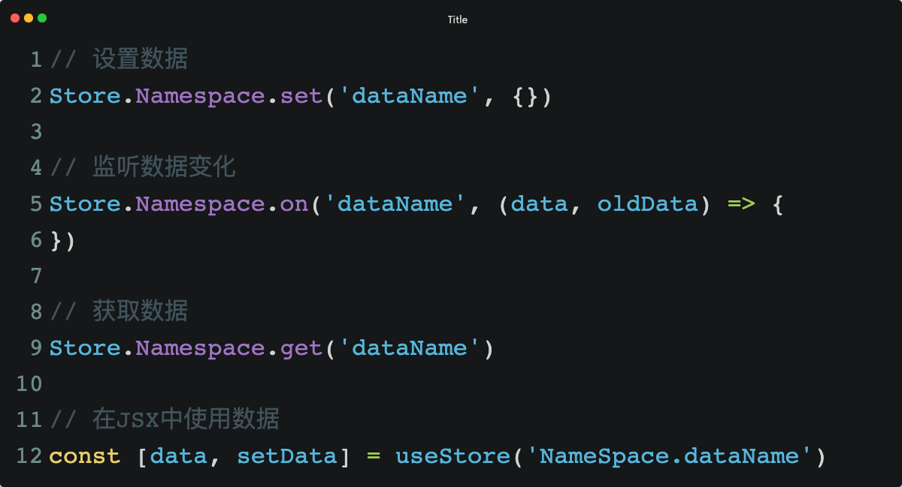

使用store 的一个对象，store 对象里面会有命名空间，使用 set, on, get 分别去设置数据、监听数据的变化和获取数据。然后在React里面，直接使用useStore来获取这个数据和监听它的变化。

事件设计：

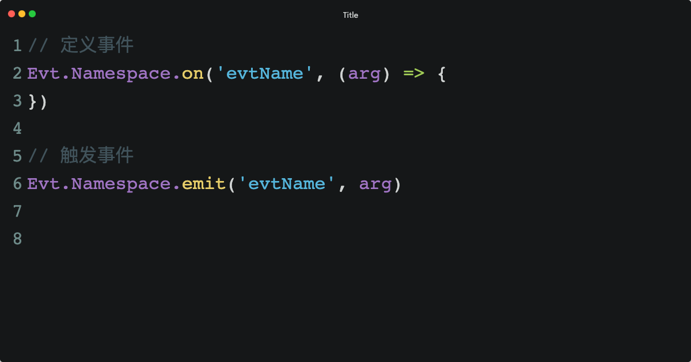

使用常用的on和emit，前面用命名空间区分。

将个人计划去绑定目标

step 1 事件绑定 数据设置

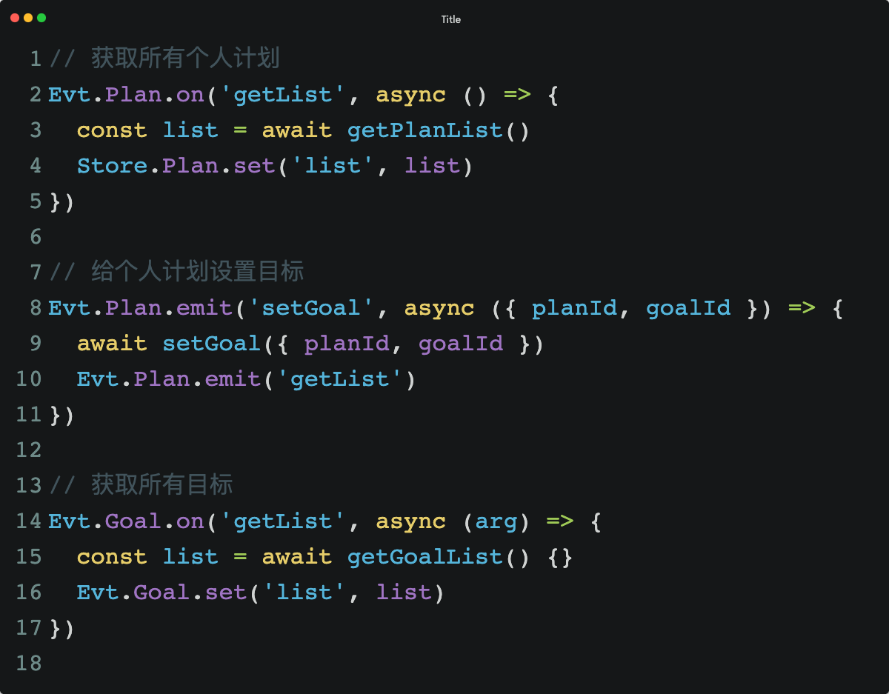

给Plan和Goal定义getList获取个人计划和所有目标。

监听获取个人计划的一个事件，设置个人计划数据，设置成功后，触发一次 Goal 的 getList 更新最新的个人计划列表。

step 2 绑定目标步骤的JSX

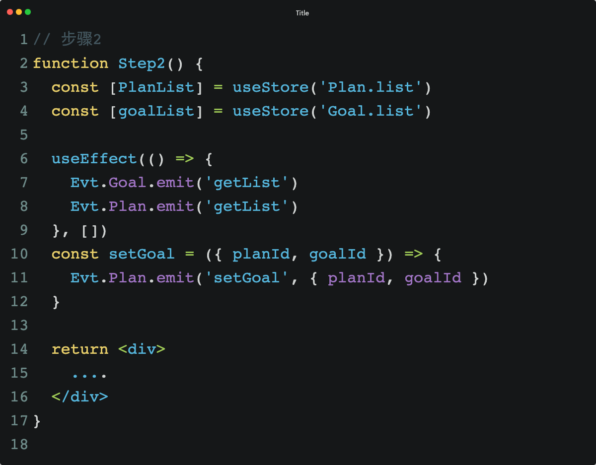

我们要监听获取目标的一个事件。右边是我们的React ，由于当前页面也需要计划和目标，所以我们要获取计划目标。需要在UC fact 里面，当刚刚进入这个步骤时，就要去触发服务端的计划和目标数据；我们会有一个方法是设置目标，我们左边去定义功能，右边在React 里面使用这些功能。

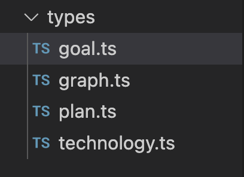

最后我们使用TypeScript 提供类型提示，提升开发效率，降低出错率。

## 表单生成和数据监听

说到表单生成我会想到：通过JSON Schema 的方式来生成表单、通过MobX的方式来监听数据的变化

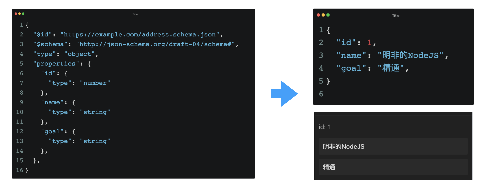

JSON Schema用来定义JSON格式，可以校验或者生成JSON，通过这样定义，我们可以得出右上角的数据格式，也通过这种定义的方式来定义右下角的表单。

> 博客有一些视频资源未展示，可到移步[知乎文章](https://zhuanlan.zhihu.com/p/585004939)，查看完整内容

对一个对象进行绑定，在React 里面直接使用被实例化的一个对象，或一个实例，里面的属性发生变化的时候，React 里面的数据也会发生变化，从而解决掉我们刚才的那个数据绑定的问题。

### 表单生成

阿里巴巴Formily 的解决方案可以解决我们的需求，下面是各个竞品的一个数据对比：

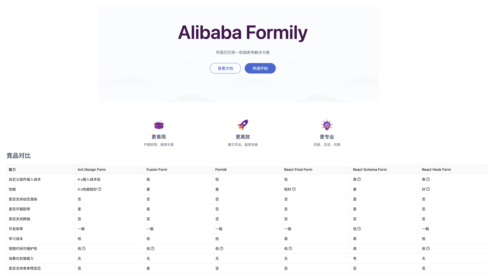

Formily 学习成本比较高，但其他性能方面良好，另外作为一个中文工具，便于理解，例如可以直接在github 上发一些中文的issue。

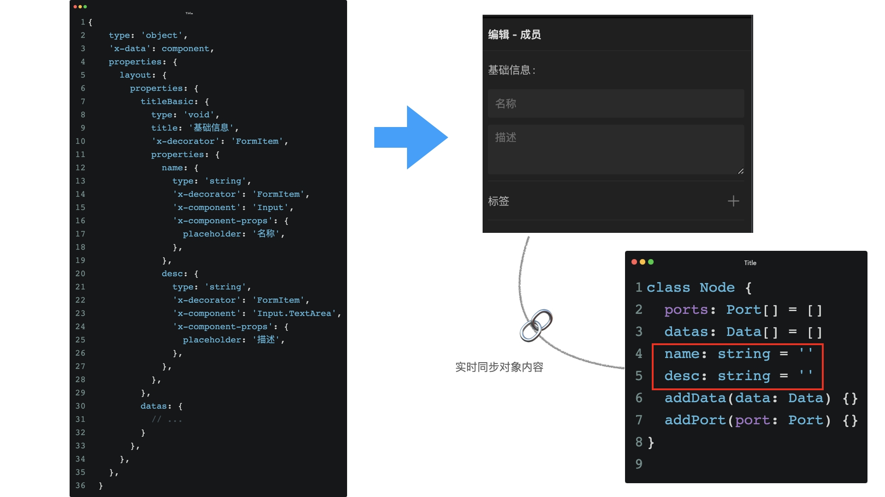

使用Formily ，我们可以通过左侧的一个JSON 数据，然后生成右侧的一个表单，解决我们表单自动生成问题。

他可以直接将生成的数据实例和表单绑定起来，表单发生变化的时候，我们的数据也会发生变化，这是解决了我们的数据引擎里面的数据和表单的数据同步问题。

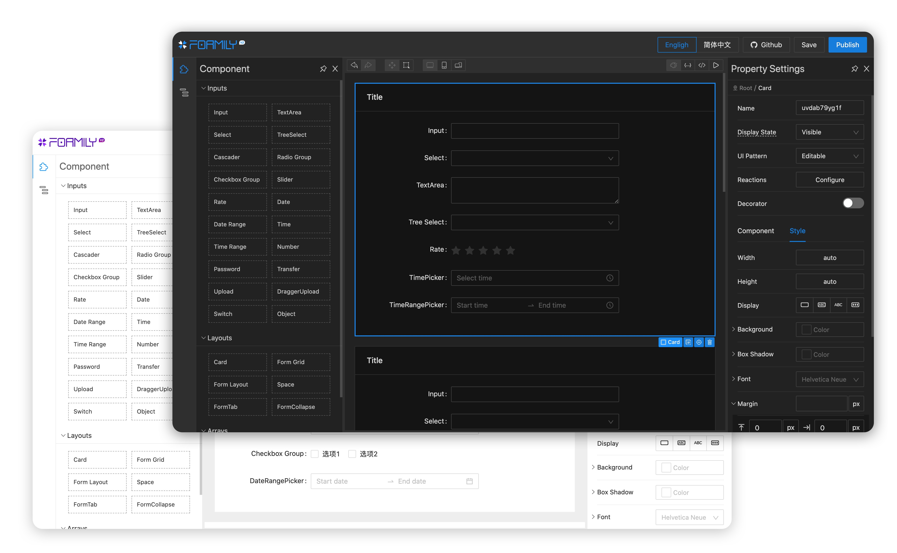

Fomily提供了一个可视化的表单生成器，不过我们在项目中没有运用。

我们在使用Formily 的时候会去实现一些自定义的功能，如何自定义功能呢？

比如我们点击上面的标题就能创建一个新的标签。

我们实现的方法是：

1. 我们在原组件的基础上去进行优化

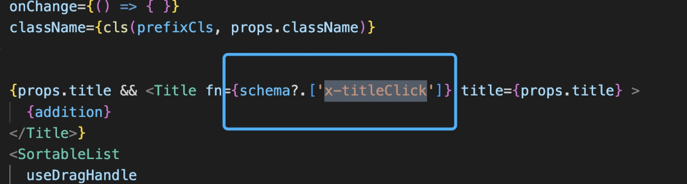

将原组件的代码直接复制出来，在标题上面添加了一个schema 里面的一个X-titleClick 方法。

1. 注册自定义组件

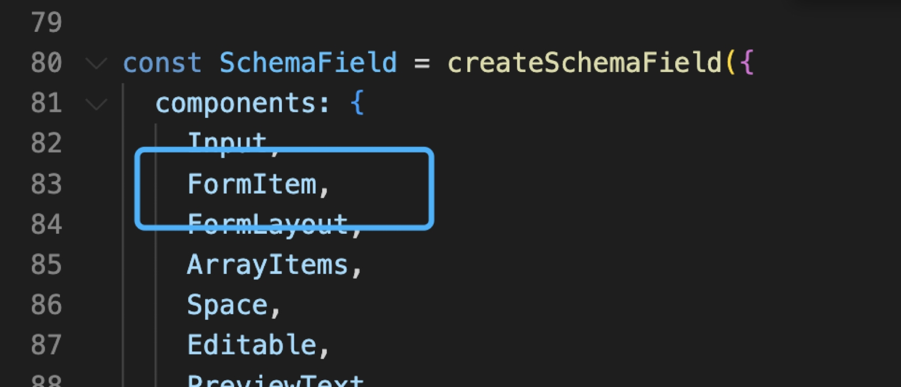

把刚才我们复制出来的一个组件注册到schema field 里面。

1. 使用自定义组件，传入所需参数

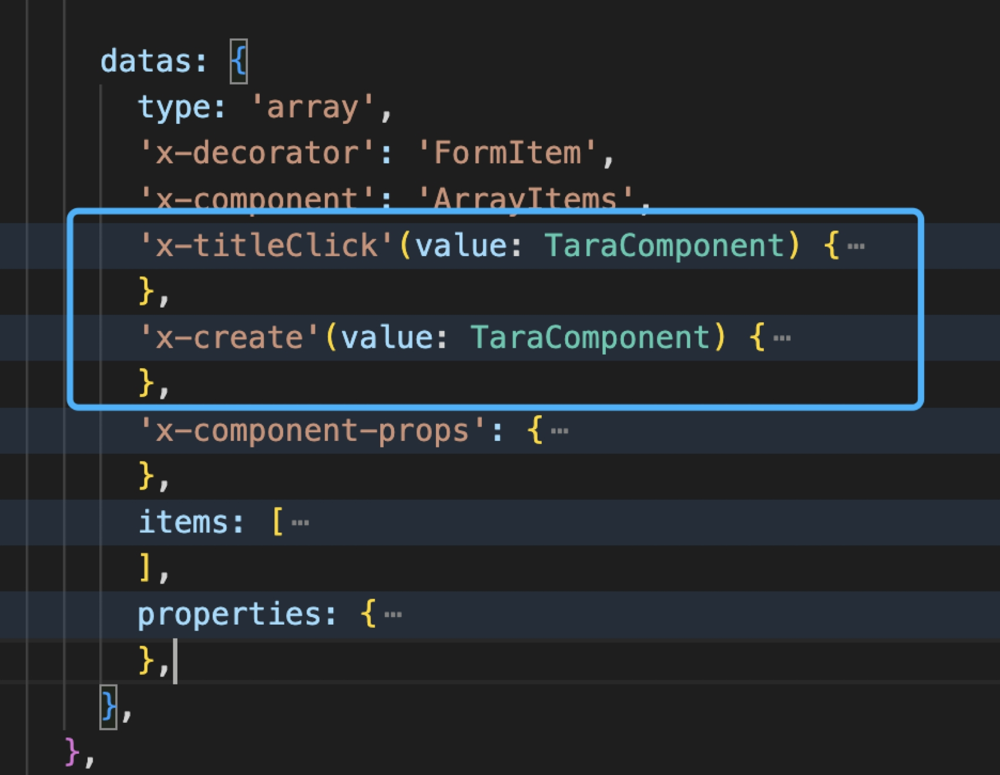

由于我们定义了一个schema 上面的一个属性。然后我们需要在写schema 的时候输入我们的方法。 

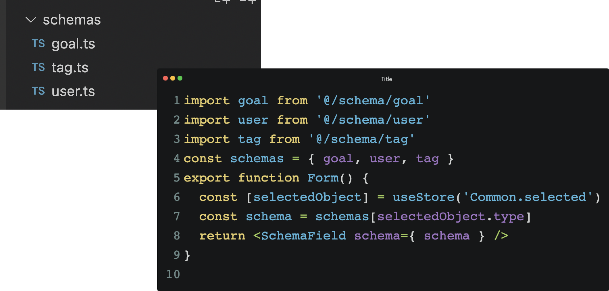

这样的话我们就可以通过schema 的方式去生成表单，schema 目录下面有各种需要生成表单的文件，文件里面写的都是schema。拿出来以后，当在下面列表里面进行数据选择，或者在画布里面点一下这个节点，我们就能监听到节点的变化，然后找到对应的schema 并把它放到这个React 里面显示出来。

### 数据同步

- 画布/右侧表单/底部列表数据实时同步（数据同步）

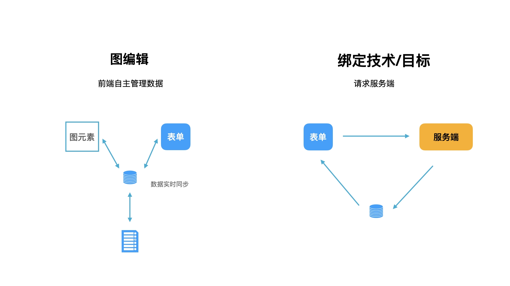

由于图编辑是前端自主管理数据，绑定技术和绑定目标需请求服务端，这两个方案其实是不同的。

前端自主管理数据，即图编辑中，Formily解决了表单和这个数据之间的一个同步。我们还需要做另一个同步：图画布里面的元素的同步，以及底部列表的同步。

> 博客有一些视频资源未展示，可到移步[知乎文章](https://zhuanlan.zhihu.com/p/585004939)，查看完整内容

MobX可以去监听数据变化，并做一些响应，Formily 提供了reactive 的一个库，效果和MobX相同。所以我们直接用Formily的reactive解决了这个问题。

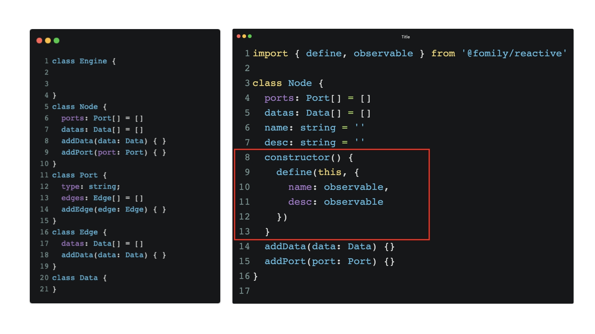

我们刚才的这个数据引擎里面的node的代码中刚刚添加了name 和 description 。我们在构造函数中去定义名字和描述需要被监听。在表单里面修改的时候，会自动修改到这个 node 实例里的属性。然后我们的这个React 代码里面就可以去监听到这个属性的变化。

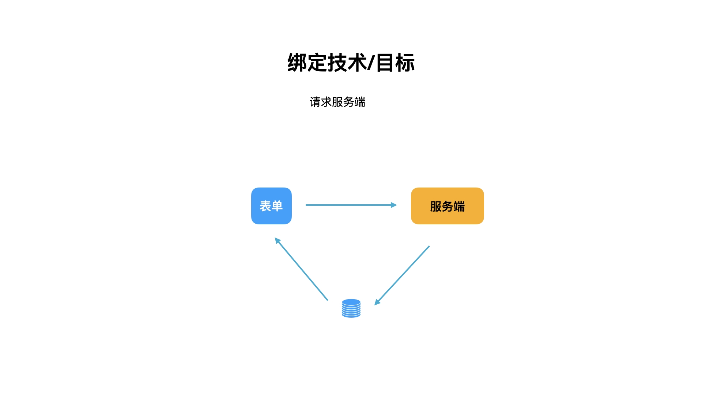

绑定技术和绑定目标这两个步骤如何用服务端接口去请求数据？

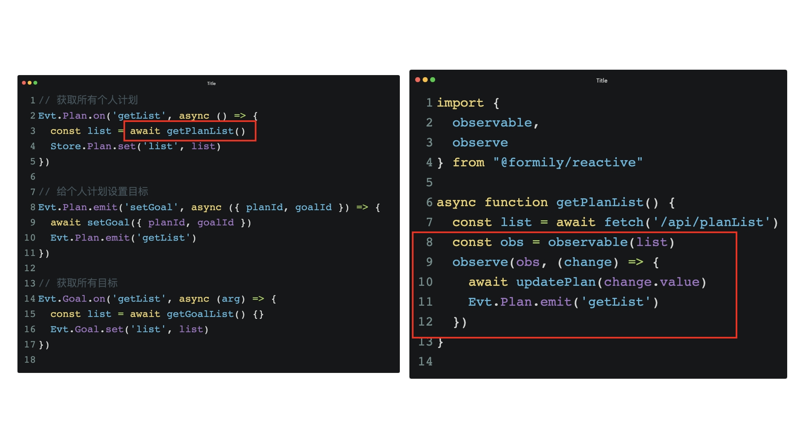

我们来看一下如何实现动态更新个人计划吧。左边有一个获取计划列表的功能，右边我们实现了一个方法叫getPlanList。首先我们去服务端获取这个列表，然后我们去通过Formily reactive 的observe 这个方法，把它变成了可被监听的一个对象。然后通过监听 observe 方法去监听这个对象。当其发生变化时，我们就去调用更新计划方法。更新完了以后，我们接着去把计划列表刷新一下，这样的话我们就可以实现在选择计划以后去触发服务端，再接着调用getList更新最新的计划列表。

## 总结

- 使用 X6 实现图编辑功能
- 创建数据引擎与 X6 进行融合
- 定义数据模型，通过Store 和Event 实现数据联动，
- 使用Formily 实现表单生成，使用@Formily/reactive 实现数据实时同步

我们通过解决以上问题来实现大型图编辑应用的基础框架和能力，当然大型应用内部细节非常复杂，往往伴随着相关的专业知识，本篇文章只是给到了一些基础问题的解决方案，可能也仅仅能够解决我在开发过程中遇到的问题。如果想要进一步与作者交流，可以联系作者微信：maydayfantast

