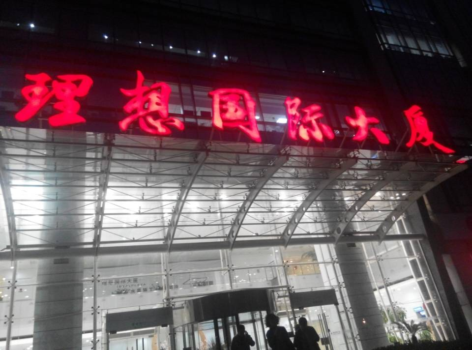
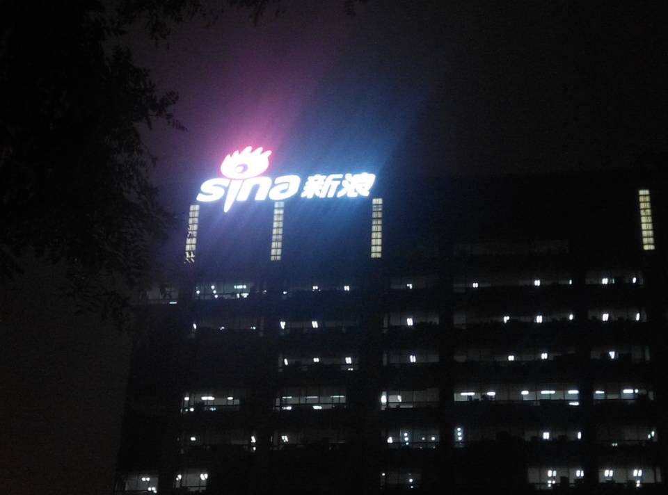
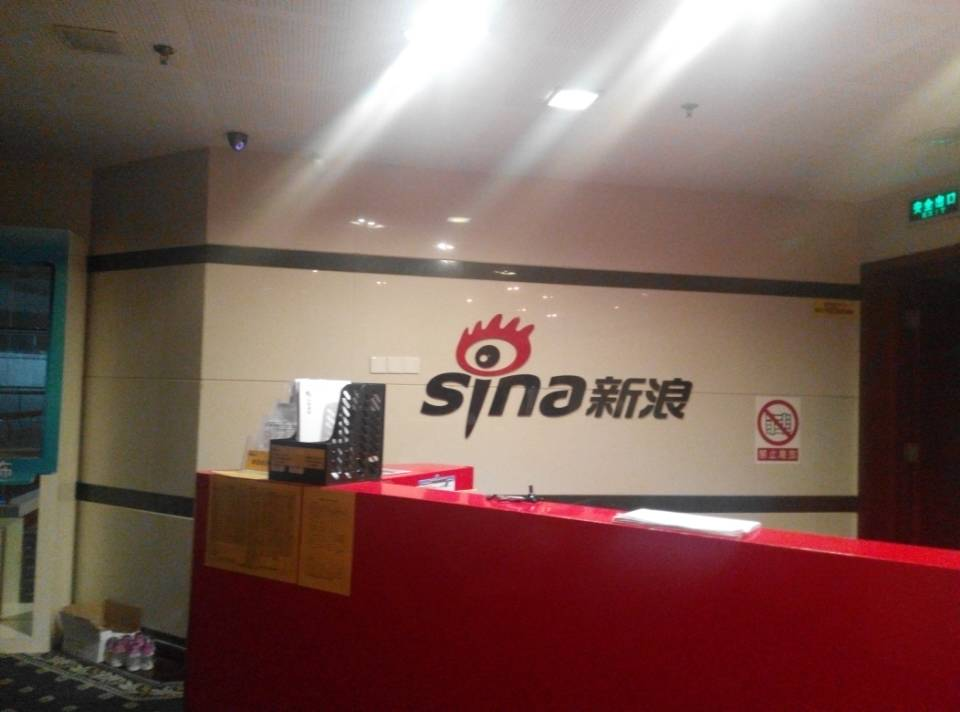
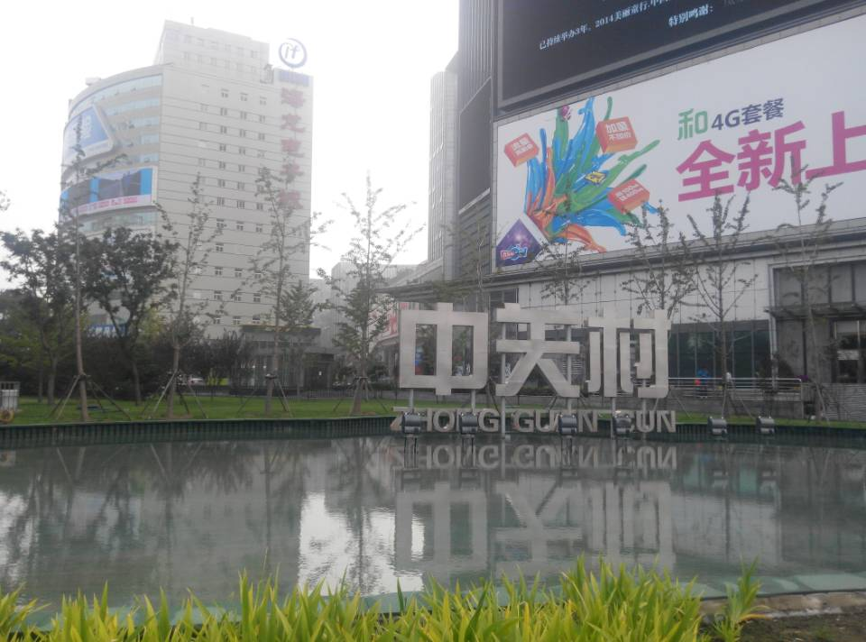
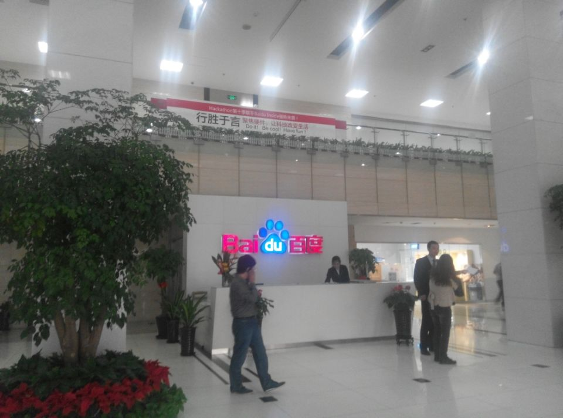
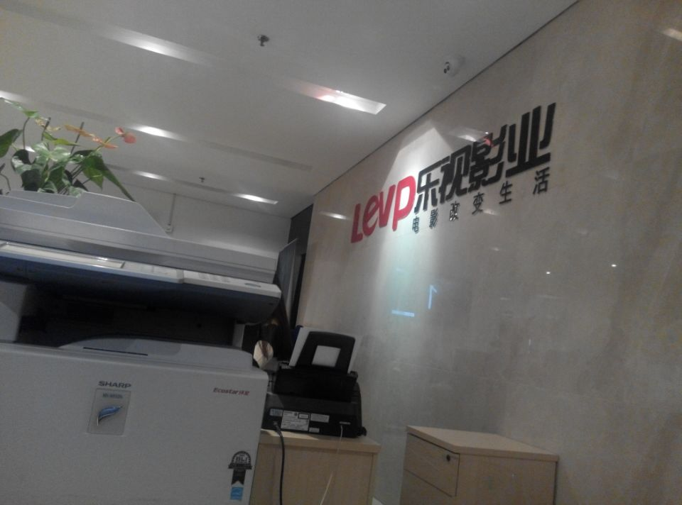
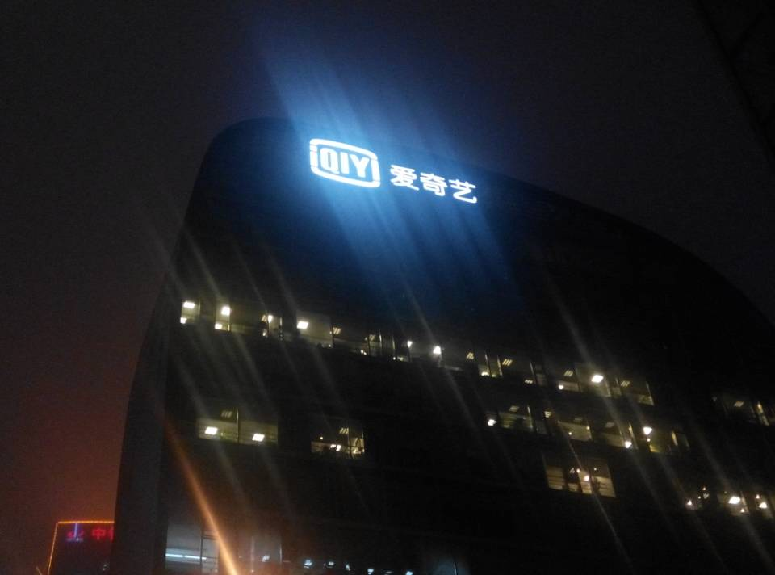

这次进京很仓促，对于自己来说其实没有任何预兆，想在北京找个实习，不过现在大三，学校方面压力也很大，导员不允许我出来实习，所以我就偷偷逃课出来了。说说最近几天的面试经历～四天，面试了六个公司，都是大公司～

先说乐视影业，乐视影业面试，来北京的处女面，开始是 hr 面试，问了很多关于学校、自己的想法的问题。原来这是乐视影业，不是乐视网，瞬间不感兴趣了。然后找了一个技术来面试，问了几个问题，都不会～刚下火车就来了也没准备太多，那个技术面也含糊不清的，乐视影业应该要扩招，但没有招实习生的打算，一开始那个主管看我简历加我的，本来想单独跟我聊的，不知道为什么变成了面试，其实主管是挺想要我的，但是后来面试完了，在 qq 问我关于时间问题，我说最早 11 月，他就也没联系过我，可能是时间原因没有通过吧

AppChina 应用汇，去到以后，前台说昨天下午打电话，改成下午了，我说没有吧。然后说没事，就让我进去了，先后有两个技术面试我，一面挺好的，第二个来面试官过来问了我几个问题，然后让我写一个 js 效果，就是应用汇上面的那个焦点图，给我一个 mac，很不习惯，做的也比较慢，后来也没做完。讲原理也没讲清楚，他说我做的和网页简历上做的出处太大，所以说面试不通过。面试中，他问我行内外联元素，我就说了说，他又问我空元素有哪些，我说什么是空元素，他说 就是不用闭合的元素，我说：就像 img、meta、br 等标签，然后我接着说，在 xhtml 标准下，这些元素都需要闭合。他回复我：错了，可以不闭合。我顿时就呵呵了～

聚美优品面试，聚美优品算是我比较重视的一个吧，聚美优品面试首先填一张调查表，前面 20 题都是好的，后面 20 题都是不好的，用关键词表述自己，每一题只能选一个词。填完了以后，正好有一个男的过来看到我，问我大三怎么出来实习，课程不耽误吗？什么的。然后有个 hr 带我去 15 楼面试，走路的时候那个 hr 问我鲁东大学是个什么学校，我是不是通过高考考进鲁东大学的，鲁东大学是不是统招本科之类的话。到了地方坐下了，稍微和 hr 聊了一会，一个技术过来面试我，了解了一些情况后，问了我一个 js 问题，在 做倒计时抢购的时候，怎么让这个倒计时与服务器同步，这个我倒是不会，但是我按照我的思路说了一下，后来他也没说怎么完成。然后又问了一些其他的都挺简单的，就让我走了，也没听动静，没过。

点心移动这个面试面的真土，先和 hr 聊了一会，说我可能 11 月才能入职，hr 给我拿了份笔试题我来写。笔试题写完了，hr 过来说，他们有一个新项目，是想找一个实习生跟着，可能马上就要开始了，所以 11 月入职不合适，然后我就走了。不过还和 hr 交了个朋友～

新浪面试，新浪的技术主管在 v2ex 或者其他地方看到我的简历，因为时间问题，直接找到我的主管不在，接我的看起来有四五十岁，长得一副大学老师的感觉的人，很和善，带着笑容。进去找了一个地方坐下，他给我拿了一份前端测试题，感觉 htmlcss 部分非常简单，到 js 就不大会了，毕竟没有系统学过 js，做完题后把题目交给他，然后一个技术过来面试，聊了一些关于我现在的技术的东西，没问什么具体的题目，可能在笔试中就已经知道是什么样子了。他说好的，然后出去了，那个年龄稍微大点的人又回来了，说了一些技术上的和我的能力范围，提了一下实习的时间问题，就让我回去了。应该是等主管回来再告诉主管，主管来定。第二天短信联系主管，主管说现在外地出差还没回来～  

最后一个，百度面试，百度前台小妹妹态度好差。我填写资料，留了个带照片的证件后取了一个访客证在旁边沙发等面试官。正好旁边来个小伙，我问他，他也是来面试的，面试 php 工程师，工作三年了，之前在腾讯工作两年，没聊多久，后来面试官把他领走了。面试我的面试官是一个很年轻的小伙子，后来问了一下他是 12 年毕业的。先问了一些 css，html 都挺简单的，不能说挺简单，其实是都会的，问了有哪些选择器，他的优先级怎么样，然后开始问 js，发现闭包是百度必问的一个问题。问了基本的变量类型有哪些。问了一些关于数组的问题，问如何取出字符串前三位，当时没答上来，不过现在想了想，如果不用方法，也可以取的，其实就是 js 不过关，都不会啊。还问了关于页面优化，用哪些方面优化，这个竟然以前没怎么接触过！我回答了关于 iframe 加载速度导致 window.onload 加载延迟的优化方法，竟然顺着话题被问到 window.onload 和 jquery 中的 $(document).ready () 的区别，我想说，我 js 学的不好 = = 不要问了好不好 = = 然后，走得时候他说，其实他大三的时候啥都不会，前端是什么都不知道，然后说才大三嘛，不要着急。意思不言而喻了。哦对了，他面试我的时候，还犯了一点小错误，“比如说 ” 其实我想说 id 不能以数字开头。不过我没说～～

通过这几个面试，总结出的几点。

1、我的技术都是野路子，没有系统学习，一些面试常考的还是面试之前准备的。

2、时间真的是一个不好控制的因素，大三出来试试水，如果没成功，回去苦练把！

3、越是大公司，面试官越和蔼，态度越好，从来不摆姿态。

4、为何我 BAT、新浪、网易以外的公司都不感兴趣呢？

5、js 学的太少了，需要恶补！

最后传点照片：

